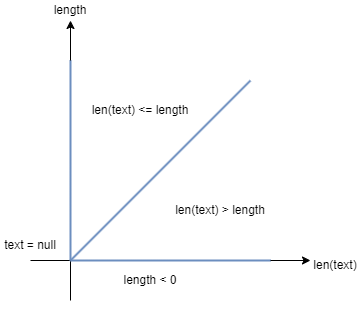

# Assignment 3

## Group M.EIC 05

| Student | UP Number |
| --- | --- |
| Clara Alves Martins | up201806528 |
| Daniel Filipe Amaro Monteiro | up201806185 |

## Black-box testing: Boundary Value Analysis

These functions were selected mostly because they can easily be tested independently and are very different from one another, in terms of parameters.

Selected package: `jpass.util`
Selected functions:
1. `StringUtils.stripNonValidXMLCharacters(final String in)`
    - Function definition
        > Replaces invalid XML Unicode characters with "?" from the input string (`in`). Should return an empty string if the input is null.
    - Step-by-step of the ‘Boundary Value Analysis’ algorithm
        1. Input and output variables (types and ranges)
            - Input
                - String `in`: no restrictions
            - Output
                - String
        2. Dependency analysis
            - the length of the input string matches the length of output string
        3. Equivalent class analysis
            - Valid
                - String `in`: null, empty, non-empty with only valid characters, non-empty with only invalid characters and non-empty with valid and invalid characters
            - Invalid
                - there are no invalid classes
        4. Class boundaries
            - Boundary **null**
                - Boundary between
                    - null
                    - not null (empty, non-empty with only valid characters, non-empty with only invalid characters and non-empty with valid and invalid characters)
                - on-point: null
                - off-point: "" and "a" and "\u0012" and "a\u0012"
            - Boundary **empty**
                - Boundary between
                    - empty
                    - non-empty (non-empty with only valid characters and non-empty with only invalid characters) (and null)
                - on-point: ""
                - off-point: "a" and "\u0012" and null
            - Boundary **only-valid**
                - Boundary between
                    - non-empty with only valid characters
                    - non-empty with valid and invalid characters (and null)
                - on-point: "a"
                - off-point: "a\u0012" and null
            - Boundary **only-invalid**
                - Boundary between
                    - non-empty with only invalid characters
                    - non-empty with valid and invalid characters (and null)
                - on-point: "\u0012"
                - off-point: "a\u0012" and null
            - Boundary **both**
                - Boundary between
                    - non-empty with valid and invalid characters
                    - non-empty with only valid characters and non-empty with only invalid characters (and null)
                - on-point: "a\u0012"
                - off-point: "a" and "\u0012" and null
        5. Testing strategy
            - We will tests the boundaries and one point inside each class
                - Class **null**: null
                - Class **empty**: ""
                - Class **non-empty with only valid characters**: "abcdef"
                - Class **non-empty with only invalid characters**: "\u0012\u0012"
                - Class **non-empty with valid and invalid characters**: "abc\u0012"
            - There are redundant tests, so these will only be tested once
    - Unit tests generated
        | char[] `text`  | Expected Output | Outcome                       |
        | ---            | ---             | ---                           |
        | null           | ""              | Test failed (output was null) |
        | ""             | ""              | Test passed                   |
        | "a"            | "a"             | Test passed                   |
        | "\u0012"       | "?"             | Test passed                   |
        | "a\u0012"      | "a?"            | Test passed                   |
        | "abcdef"       | "abcdef"        | Test passed                   |
        | "\u0012\u0012" | "??"            | Test passed                   |
        | "abc\u0012"    | "abc?"          | Test passed                   |

2. `CryptUtils.getSha256Hash(final char[] text)`
    - Function definition
        > Calculates the `text`'s SHA-256 hash. If the input is invalid, an exception should be thrown.
    - Step-by-step of the ‘Boundary Value Analysis’ algorithm
        1. Input and output variables (types and ranges)
            - Input
                - char[] `text`: not null
            - Output
                - byte[]
        2. Dependency analysis
            - no two different inputs should ever give the same output
            - the output always has the same length, independently of the input
        3. Equivalent class analysis
            - Valid
                - char[] `text`: empty and non-empty
            - Invalid
                - char[] `text`: null
        4. Class boundaries
            - Boundary **null**
                - Boundary between
                    - null
                    - not null (empty and non-empty)
                - on-point: null
                - off-point: {} and {'a'}
            - Boundary **empty**
                - Boundary between
                    - empty
                    - non-empty (and null)
                - on-point: {}
                - off-point: {'a'} and null
            - Boundary **non-empty**
                - Boundary between
                    - non-empty
                    - empty (and null)
                - on-point: {'a'}
                - off-point: {} and null
        5. Testing strategy
            - We will tests the boundaries and one point inside each class
                - Class **null**: null
                - Class **empty**: {}
                - Class **non-empty**: {'a', 'b', 'c', 'd', 'e', 'f'}
            - There are redundant tests, so these will only be tested once
    - Unit tests generated
        | char[] `text`                  | Expected Output                                                    | Outcome     |
        | ---                            | ---                                                                | ---         |
        | null                           | Exception thrown during execution                                  | Test passed |
        | {}                             | "E3B0C44298FC1C149AFBF4C8996FB92427AE41E4649B934CA495991B7852B855" | Test passed |
        | {'a'}                          | "CA978112CA1BBDCAFAC231B39A23DC4DA786EFF8147C4E72B9807785AFEE48BB" | Test passed |
        | {'a', 'b', 'c', 'd', 'e', 'f'} | "BEF57EC7F53A6D40BEB640A780A639C83BC29AC8A9816F1FC6C5C6DCD93C4721" | Test passed |

3. `StringUtils.stripString(String text, int length)`
    - Function definition
        > Truncates the input string (`text`) to a determined size (`length`), adding "..." at the end if the string was truncated. Should return null if the input `text` is null. Should return "" if the input `length` is invalid.
    - Step-by-step of the ‘Boundary Value Analysis’ algorithm
        1. Input and output variables (types and ranges)
            - Input
                - String `text`: no restrictions
                - int `length`: `length` >= 0
            - Output
                - String
        2. Dependency analysis
            - the ouput string's length will be equal to the input string's length if that length is lower or equal to `length`, otherwise it will be `length` + 3
        3. Equivalent class analysis
            - Valid
                - String `text`: empty, non-empty with length smaller or equal to `length` and non-empty with length bigger than `length`
                - int `length`: length >= 0
            - Invalid
                - String `text`: null
                - int `length`: length < 0
            
             \
            Graphical representation of the equivalence classes
        4. Class boundaries
            - Boundary **negative**
                - Boundary between
                    - zero
                    - negative integer
                - on-point: 0
                - off-point: -1
            - Boundary **positive**
                - Boundary between
                    - zero
                    - positive integer
                - on-point: 0
                - off-point: 1
            - Boundary **null**
                - Boundary between
                    - null
                    - not null (empty and non-empty)
                - on-point: null
                - off-point: "" and "a"
            - Boundary **empty**
                - Boundary between
                    - empty
                    - non-empty (and null)
                - on-point: ""
                - off-point: "a" and null
            - Boundary **small0** (`length`=0)
                - Boundary between
                    - input string `text` with length smaller or equal to the input `length`
                    - input string `text` with length bigger than the input `length`
                - on-point: `text`="" and `length`=0
                - off-point: `text`="a" and `length`=0
            - Boundary **small1** (`length`=1)
                - Boundary between
                    - input string `text` with length smaller or equal to the input `length`
                    - input string `text` with length bigger than the input `length`
                - on-point: `text`="a" and `length`=1
                - off-point: `text`="ab" and `length`=1
        5. Testing strategy
            - We will tests the boundaries and one point inside each class
                - Class **null**( `text` = null ) and Class **negative**( `length` = -1 ) will only have 1 test each
                - Class **empty**: "" & 3
                - Class **length of `text` smaller or equal to `length`**: "abcdef" & 9
                - Class **length of `text` bigger than `length`**: "abcdef" & 3
            - Invalid inputs are only tested once (with valid partitions)
            - There are redundant tests, so these will only be tested once
           
    - Unit tests generated
        | String `text` | int `length` | Expected Output | Outcome                                            |
        | ---           | ---          |   ---           | ---                                                |
        | null          | 0            |  null           | Test passed                                        |
        | ""            | -1           |  "..."          | Test failed (with StringIndexOutOfBoundsException) |
        | ""            | 0            |  ""             | Test passed                                        |
        | ""            | 1            |  ""             | Test passed                                        |
        | ""            | 3            |  ""             | Test passed                                        |
        | "a"           | 0            |  "..."          | Test passed                                        |
        | "a"           | 1            |  "a"            | Test passed                                        |
        | "ab"          | 1            |  "a..."         | Test passed                                        |
        | "abcdef"      | 3            | "abc..."        | Test passed                                        |
        | "abcdef"      | 9            | "abcdef"        | Test passed                                        |
