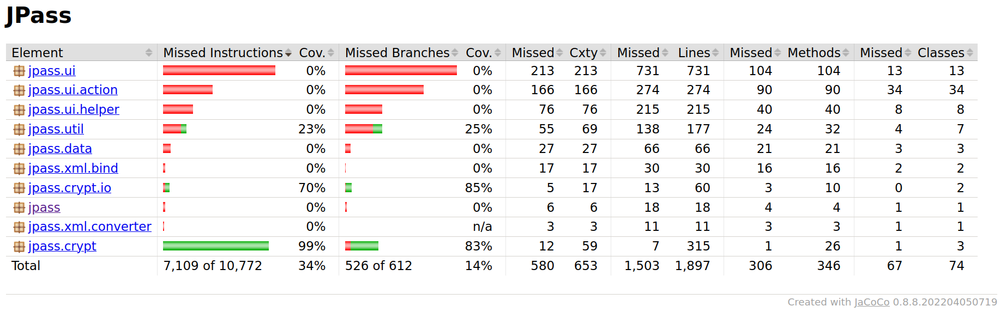
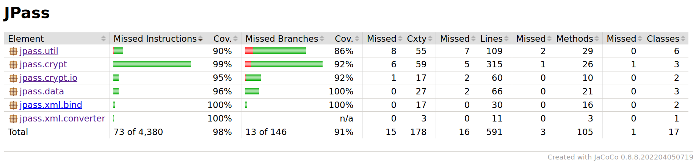

# Assignment 5

## Group M.EIC 05

| Student | UP Number |
| --- | --- |
| Clara Alves Martins | up201806528 |
| Daniel Filipe Amaro Monteiro | up201806185 |

## White-box testing: Structural Testing

### Code Coverage from the Tests from Assignment 2 and 3

When collecting line and branch coverage for the tests developed for assignment 2 and 3, we had to generate the report using three commands:
1. `mvn package -DskipTests` to generate the `target` folder and the `jpass.properties` file
2. `mvn test` to runs all the implemented tests
3. `mvn jacoco:report` to collect the JaCoCo report since some tests resulted in a failure

We removed classes related to the `ui` and the main class by inserting the following configuration in the JaCoCo plugin:

```xml
<configuration>
    <excludes>
        <exclude>
            jpass/ui/**/*
        </exclude>
        <exclude>
            jpass/util/SpringUtilities.class
        </exclude>
        <exclude>
            jpass/JPass.class
        </exclude>
    </excludes>
</configuration>
```

After running, the JaCoCo presented the following result, not achieving the desired 100% line and branch coverage.



### Test Development

#### Migrating JUnit to version 5
To facilitate the implementation of some of the tests, we decided to migrate the project from version 4.x.x to version 5.x.x, gaining extra flexibility and ergonomy.

#### JUnit Features Used
- Type of Asserts
    - **assertEquals(expected, actual)**
        - Verifies that the actual value is the same as the one we expected
        - It is the most used type of assertion, and extremely versatile
        - It cannot correctly verify if the actual array is equal to the expected one, so `assertTrue` is used in combination with `Arrays.equals(expected, actual)` in those cases. However, `assertEquals` can be used to verify the array's length
        - Used when testing the `Cbc`, `Stream`, `DataModel`, `DocumentProcessException`, `EntriesRepository`, `ClipboardUtils`, `Configuration`, `CryptUtils`, `DateUtils`, `StringUtils`, `Entry` and `Entries` classes
    - **assertTrue(condition)**
        - Verifies that the condition is true
        - Used in combination with `Arrays.equals(expected, actual)` to verify that the actual array is equal to the expected one
        - Used when testing the `Aes256`, `Cbc`, `Stream`, `DataModel` and `Configuration` classes
    - **assertFalse(condition)**
        - Verifies that the condition is false
        - Used when testing the `DataModel` and `Configuration` classes
    - **assertNull(actual)**
        - Verifies that the actual value is null
        - Used to verify that a value is not initialized or atributed
        - Used when testing the `ClipboardUtils`, `DataModel` and `Entry` classes
    - **assertNotNull(actual)**
        - Verifies that the actual value is not null, which means the value was atributed
        - Used when testing the `Entry` class
    - **assertThrows(expectedType, executable)**
        - Verifies that an Exception of the expected type is thrown during the execution of the executable
        - Used when testing the `EntriesRepository` and `CryptUtils` classes
    - **fail**
        - Used to fail a test when an unexpected exception was thrown
        - Used when testing the `EntriesRepository`, `ClipboardUtils` and `CryptUtils` classes
- Annotations
    - **BeforeEach**
        - Initializes values required by every test in that test class
        - Used when testing the `Cbc` and `Entry` classes
    - **ParameterizedTest** and **ValueSource**
        - Allows us to execute a test with multiple parameters
        - Used when testing the `Cbc` class
        - Could have been useful in some other classes if we had migrated the project earlier

### Code Coverage after implementing more tests
We decided to not comment the failing tests, even though code and condition coverage can be obtained without failing tests. This implied that the JaCoCo report had to be obtained using the same three commands as at the beginning of this assignment.



#### Conclusions

As previously shown, we were successful in reaching more than 90% line & condition coverage. We were also successful in updgrading our JUnit from version 4.x.x to 5.x.x. We had to do this in order to benefit from ergonomic improvements to the parameterized testing functionalities. Despite covering 90% of the codebase, we feel that pursuing line and condition coverage above all else may not be the most effective approach to mitigating and preventing faults in the code.
