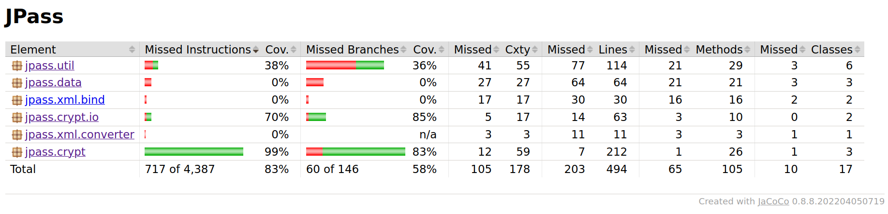

# Assignment 4

## Group M.EIC 05

| Student | UP Number |
| --- | --- |
| Clara Alves Martins | up201806528 |
| Daniel Filipe Amaro Monteiro | up201806185 |

## White-box testing: Structural Testing

### Code Coverage from the Tests from Assignment 2 and 3
When collecting line and branch coverage for the tests developed for assignment 2 and 3, we had to generate the report using `mvn jacoco:report` since some of the tests resulted in a failure.

We removed classes related to the `ui` by inserting the following configuration in the JaCoCo plugin:

```xml
<configuration>
    <excludes>
        <exclude>
            jpass/ui/**/*
        </exclude>
        <exclude>
            jpass/util/SpringUtilities.class
        </exclude>
    </excludes>
</configuration>
```

After running, the JaCoCo presented the following result, not achieving the desired 100% line and branch coverage.



### Test Development

#### Package `jpass.crypt`

| Function | Input(s) | Expected Result | Outcome |
| -------- | -------- | --------------- | ------- |
| encrypt(byte[] data) | data = null | _encrypted stays the same | Passed |
| encrypt(byte[] data, int length) | data = null, length = 0 | _encryted stays the same | Passed |
| decrypt(byte[] data) | data = null | _decrypted stays the same | Passed |
| decrypt(byte[] data, int length) | data = null, length = 0 | _decrypted stays the same | Passed |

#### Package `jpass.crypt.io`
In this case, we copied the test `shouldDecryptAnEncryptedRandomMessage` and modified it in order to use the constructors `CryptOutputStream(OutputStream parent, byte[] key, byte[] iv)` and `public CryptInputStream(InputStream parent, byte[] key, byte[] iv)` and the function `CryptOutputStream.write(int b)`. The test passed.

#### Package `jpass.`


### Code Coverage after implementing more tests
Once again, we run the command `mvn test && mvn jacoco:report` to run the tests and generate the JaCoCo report.

