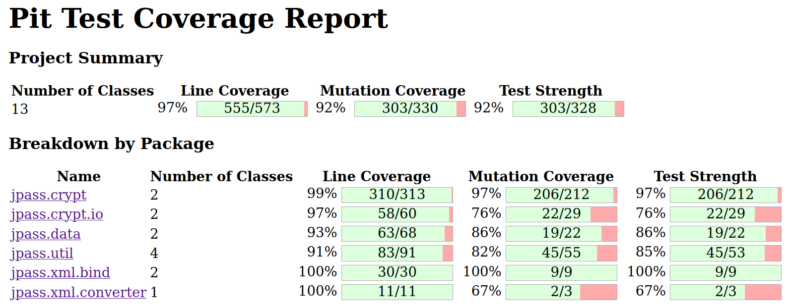

# Assignment 9

## Group M.EIC 05

| Student | UP Number |
| --- | --- |
| Clara Alves Martins | up201806528 |
| Daniel Filipe Amaro Monteiro | up201806185 |

## White-box testing: Mutation testing

To generate the report from the PIT library, run:

`mvn test-compile org.pitest:pitest-maven:mutationCoverage`

### Before Mutation Testing

Mutation testing requires a green suite. The following table resumes the corrections / modifications made to the failing tests from previous assignments.
| Test                                         | Previous Outcome                                   | Action Taken   | Current Outcome |
| ---                                          | ---                                                | ---            | ---             |
| DateUtilsTest.validNullFormatIsoDateTimeTest | Test failed (with NullPointerException)            | Commented out test | N/A         |
| nullStripNonValidXMLCharactersTest           | Test failed (expected "", output was null)         | Fixed source code  | Test passed |
| normalNegativeStripStringTest                | Test failed (with StringIndexOutOfBoundsException) | Fixed source code  | Test passed |
| boundaryNegativeStripStringTest              | Test failed (with StringIndexOutOfBoundsException) | Fixed source code  | Test passed |

After analysing the report, we found the following surviving mutants:
* jpass.crypt.Aes256 (3) \
    
* jpass.crypt.Cbc (6) \
    
    
* jpass.crypt.io.CryptInputStream (6) \
    
* jpass.crypt.io.CryptOutputStream (1) \
    
* jpass.data.EntriesRepository (3) \
    
* jpass.util.Configuration (6) \
    
* jpass.util.CryptUtils (2) \
    
* jpass.util.StringUtils (8) \
    
* jpass.xml.converter.XmlConverter (1) \
    

For the sake of simplicity, most of the mutants successfully killed were omitted from the previous list.

### Mutation Testing

#### Failed mutation tests
A list with all the surviving mutations (before the new tests) is presented below:
* jpass.crypt.Aes256
    * 🟢 212 - changed conditional boundary
    * 🟢 215 - replaced return value with `null`
    * 🟢 228 - changed conditional boundary
* jpass.crypt.Cbc
    * 🔵 162 - changed conditional boundary
    * 🔵 184 - changed conditional boundary
    * 🔴 245 - changed conditional boundary (2x)
    * 🔴 250 - changed conditional boundary
    * 🔴 253 - remove call to `close`
* jpass.crypt.io.CryptInputStream
    * 🔴 115 - replaced subtraction with addition
    * 🔴 116 - changed conditional boundary
    * 🔴 129 - changed conditional boundary
    * 🔴 154 - changed conditional boundary
    * 🔴 164 - removed call to `readFromStream`
    * 🔴 178 - removed call to `close`
* jpass.crypt.io.CryptOutputStream
    * 🔴 83 - removed call to `nextBytes`
* jpass.data.EntriesRepository
    * 🔴 128 - removed call to `close`
    * 🔴 152 - negated conditional
    * 🔴 153 - removed call to `close`
* jpass.util.Configuration
    * 🔴 54 - negated conditional (2x)
    * 🔴 56 - removed call to `load`
    * 🔴 57 - removed call to `close`
    * 🔴 75 - replaced return value wih `null`
    * 🟢 92 - replaced boolean return with `false`
* jpass.util.CryptUtils
    * 🔴 90 - removed call to `reset`
    * 🔴 95 - removed call to `reset`
* jpass.util.StringUtils
    * 🟢 61 - changed conditional boundary (2x)
    * 🟢 62 - changed conditional boundary (2x) & negated conditional
    * 🔵 63 - changed conditional boundary (2x) & negated conditional
* jpass.xml.converter.XmlConverter
    * 🔴 54 - removed call to `setDefaultUseWrapper`

Legend:
* 🟢 - Mutation Killed after new tests
* 🔵 - Equivalent Mutation
* 🔴 - Mutation Survived after new tests

#### Equivalent Mutants
* jpass.crypt.Cbc: lines 162 and 197 (2 equivalent mutants)
    - These mutants changed the conditional boundary of `length <= 0` (probably to `length < 0`), which doesn't affect the function since this value is rechecked below in the loop condition `i < length`. They behave the same way as the original code, therefore are unkillable.
* jpass.util.StringUtils: line 63 (3 equivalent mutants)
    - The comparisons presented in this line compare a `char` with `0x10000` and `0x10FFFF`. However, a char will always be `<= 0xFFFF` which makes these comparisons always yield the same result. The first comparison (`current >= 0x10000`) will always be false and the second comparison (`current <= 0x10FFFF`) will always be true. Applying the `&&` operator to these comparisons will always yield false.
    - Changing the comparison operators from `>=` and `<=` to `>` and `<` will never affect the result, since the `char current` will never be equal to any of those values.
    - Negating the first comparison will change the result of the `&&` operator since `true && true = true`. And the result should have been `false`.
    - Negating the second comparison will not change the result of the `&&` operator since `false && false = false` (as it should be).
    - Therefore, changing the conditional boundaries of both the first and second conditions and negating the second condition are equivalent mutants and will behave exactly like the original code.

#### New Tests Created
* jpass.crypt.Aes256
    - substituteWord and rotate functions were set to public (previously private)
        | Function Tested | Input                    | Expected                 | Outcome     |
        | ---             | ---                      | ---                      | ---         |
        | substituteWord  | {0x01, 0x02, 0x03, 0x04} | {0x7c, 0x77, 0x7b, 0xf2} | Test passed |
        | rotate          | {0x01, 0x02, 0x03, 0x04} | {0x02, 0x03, 0x04, 0x01} | Test passed |
* jpass.util.Configuration
    - the property `ui.theme.dark.mode.enabled` was set to `true` in the `jpass.properties` file
        | Function Tested | Input                        | Expected | Outcome     |
        | ---             | ---                          | ---      | ---         |
        | is              | "ui.theme.dark.mode.enabled" | True     | Test passed |
* jpass.util.StringUtils
    - note: this test was implemented using `ParameterizedTest` and `ValueSource` due to its repetitive code
        | Function Tested            | Input      | Expected   | Outcome     |
        | ---                        | ---        | ---        | ---         |
        | stripNonValidXMLCharacters | "\u0020"   | "\u0020"   | Test passed |
        | stripNonValidXMLCharacters | "\uD7FF"   | "\uD7FF"   | Test passed |
        | stripNonValidXMLCharacters | "\uE000"   | "\uE000"   | Test passed |
        | stripNonValidXMLCharacters | "\uFFFD"   | "\uFFFD"   | Test passed |
        | stripNonValidXMLCharacters | "\u10000"  | "\u10000"  | Test passed |
        | stripNonValidXMLCharacters | "\u10FFFF" | "\u10FFFF" | Test passed |

#### Mutations Ignored

We decided to ignore the mutants that would require Dependency Injection to verify that certain methods were being called.
* jpass.crypt.Cbc - line 253
* jpass.crypt.io.CryptInputStream - lines 164 and 178
* jpass.data.EntriesRepository - lines 128, 152, 153
    - We need Dependency Injection to test lines 128 and 153 and we need to be able to test line 153 in order to test line 152.
* jpass.util.Configuration - lines 56 and 57
* jpass.util.CryptUtils - lines 90 and 95
* jpass.xml.converter.XmlConverter - line 54

Methods including calls to random generators without seed were also ignored.
* jpass.crypt.io.CryptOutputStream - line 83

Due to the difficulty in setting the `this._outBuffer` to the necessary values (0 and 16), the following mutants were not killed.
* jpass.crypt.Cbc: line 245
* jpass.crypt.Cbc: line 250
    - In line 245,  we checked `pad <= 0 || pad > BLOCK_SIZE` and threw an exception if this was `true`.
    - In line 249, we assigned `BLOCK_SIZE - pad` to the variable `left`. And in line 250, we verified `left > 0`.
    - From line 245, we can assume that `0 < pad <= BLOCK_SIZE`, which would imply that `BLOCK_SIZE > BLOCK_SIZE - pad >= 0`.
    - In conclusion, `left` could be `0`.

Note: The value of `this._outBuffer` could be set in the `encrypt` or `decrypt` functions. However, these functions require calling `encryptBlock` or `decryptBlock` functions which use the `Aes256.encrypt` or `Aes256.decrypt` functions (cryptographic functions). We could try using Mockito to solve this issue but the `Aes256` is final and doesn't allow extensions.

### After Mutation Testing

If we consider the mutation score to be the number of killed mutants divided by the number of non-equivalent mutants, the score would be 303/325 * 100% = 93.2%. (There are 330 mutants and 5 equivalent mutants.)

### Final remarks

We struggled to improve our "mutation coverage" as much as we wanted for multiple reasons. The most obvious reason is that most of the "low-hanging fruit" has already been thoroughly tested, leaving only the most hard-to-test code remaining. Among this code, we can spot some themes: functions that sorely need dependency injection in order to be better tested, exception-catching code that is nearly impossible to run, calls to `close` that, despite being redundant in many cases, their removal still trigger a mutation fail, and finally, modifications to object properties that don't have an impact on the final result also trigger mutation fails. Addressing these mutation fails would require rewriting quite a bit of source code, and we felt it wasn't in the spirit of this course to do such a thing.
