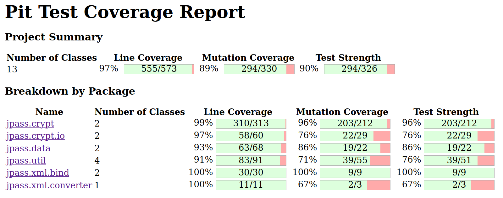

# Assignment 9

## Group M.EIC 05

| Student | UP Number |
| --- | --- |
| Clara Alves Martins | up201806528 |
| Daniel Filipe Amaro Monteiro | up201806185 |

## White-box testing: Mutation testing

To generate the report from the PIT library, run:

`mvn test-compile org.pitest:pitest-maven:mutationCoverage`

### Before Mutation Testing

Mutation testing requires a green suite. The following table resumes the corrections / modifications made to the failing tests from previous assignments.
| Test                                         | Previous Outcome                                   | Action Taken   | Current Outcome |
| ---                                          | ---                                                | ---            | ---             |
| DateUtilsTest.validNullFormatIsoDateTimeTest | Test failed (with NullPointerException)            | Commented out test | N/A         |
| nullStripNonValidXMLCharactersTest           | Test failed (expected "", output was null)         | Fixed source code  | Test passed |
| normalNegativeStripStringTest                | Test failed (with StringIndexOutOfBoundsException) | Fixed source code  | Test passed |
| boundaryNegativeStripStringTest              | Test failed (with StringIndexOutOfBoundsException) | Fixed source code  | Test passed |

After analysing the report, we found the following surviving mutants:
* jpass.crypt.Aes256 (3)
    
* jpass.crypt.Cbc (6)
    
    
* jpass.crypt.io.CryptInputStream (6)
    
* jpass.crypt.io.CryptOutputStream (1)
    
* jpass.data.EntriesRepository (3)
    
* jpass.util.Configuration (6)
    
* jpass.util.CryptUtils (2)
    
* jpass.util.StringUtils (8)
    
* jpass.xml.converter.XmlConverter (1)
    

For the sake of simplicity, most of the mutants successfully killed were omitted from the previous list.

### Mutation Testing

Equivalent mutants: Cbc lines 162, 197 -> mutant changed conditional boundary (probably to <) which doesn't affect the code

TODO: 
Cbc.finishDecryption

### After Mutation Testing

